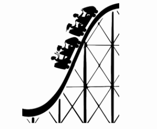

# Problem 2025-J1: Roller Coaster Ride

You are spending the day at the CEMC's funfair. One of the rides at the funfair is a roller coaster which has one train with a number of cars. Each car holds the same number of people.

When you arrive at the roller coaster, you see that there is a line. Your job is to determine whether or not you will be on the next train ride, assuming that every car is fully occupied for every ride.



## Input Specification

The first line of input contains a positive integer, $N$, representing your place in line. For example, if $N$ is $5$ then you are the fifth person in line.

The second line contains a positive integer, $C$, representing the number of car the train has.

The third line contains a positive integer, $P$, representing the number of people a single car holds.

## Output Specification

Output either `yes` or `no`, indicating whether or not you will be on the next train ride.

## Sample Input 1

```
14
3
2
```

### Output for Sample Input 1

```
no
```

### Exmplanation of Output for Sample Input 1

The train has $3$ cars and each car holds $2$ people. Therefore, $6$ people can ride the next train, Since you are the 14th person in line, you will not be on the next train ride.

## Sample Input 2

```
12
4
3
```

### Output for Sample Input 2

```
yes
```

### Explanation of Output for Sample Input 2

The train has $4$ cars and each car holds $3$ people. Therefore, $12$ people can ride the next train. Since you are the 12th person in line, you will be on the next train ride.