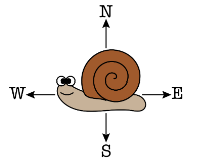
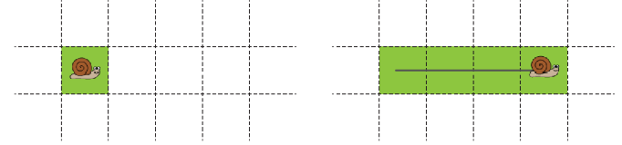
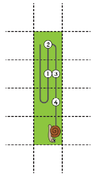

# Problem 2026-J4: Snail Path

## Problem Description



A snail is crawling across an infinite grid of equally sized squares. It can crawl horizontally (east and west) or vertically (north and south), but it cannot crawl diagonally.

As the snail crawls, it leaves a trail of slime which makes the squares of the grid it touches *slimy*.

For example, after the snail below crawls east 3 squares, there will be 4 *slimy* squares as shown below:



Given the movements taken by the snail, your job is to determine how many times the snail enters a *slimy* square.

## Input Specification

The first line of input contains a positive integer, $M$, representing the number of movements taken by the snail.

The next $M$ lines will specify the snail's movements, in order. Each movement will contain an uppercase directional letter (**N, E, S, or W**), followed by a positive integer less than or equal to 20 representing the number of squares the snail crawls in that direction.

The following table shows how the 15 available marks are distributed:

| Marks | Description | Bound |
| :---: | --- | --- |
| 4 | The snail will never crawl north or west of its initial position and will stay close to its initial position | $M \leq 20$ |
| 3 | The snail will stay close to its initial possition | $M \leq 20$ |
| 6 | The snail may crawl quite far from its initial position | $M \leq 1200$ |
| 2 | The snail may crawl extremely far from its initial position. | $M \leq 200,000$ |

## Output Specification

Output the non-negative integer, $T$, which is the number of times the snail enters a *slimy* square.

## Sample Input 1

```
3
S2
N2
S3
```



## Sample Output 1

```
4
```

## Explanation of Output for Sample Input 1

The diagram shows the snail's path. Whenever the snail enters a *slimy* square, a numbered circle is placed along the path.

Notice that a single *slimy* square can be entered multiple times.

## Sample Input 2

```
3
S2
W15
N20
```

## Output for Sample Input 2

```
0
```

## Exmplanation of Output for Sample Input 2

The snail's path will consist of 38 *slimy* squares. However, the snail never returns to a square after leaving it, so the snail never enters a slimy square.

## Technical Notes

You might receive an unpredicatable error message if your program uses too much memory.

Python 3 submissions for this problem will be evaluated using the standard interpreter `python3` (Version 3.10.12) instead of `pypy3 7.3.9` (Version 3.8.13).