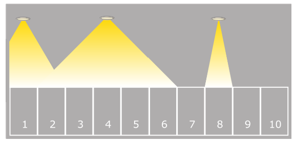

# Problem 2026-J5: Snail Path

## Problem Description

Along one wall of a parking garage there are identical parking spots numbered form 1 to N.

A collection of lights illuminates the parking garage. Each light shines on some number of adjacent parking spots.



You will be questioned about the parking spots. For each parking spot you are questioned about, your job is to determine whether or not it is illuminated by at least one light.

## Input Specification

The first line of input contains a positive integer, $N$, representing the number of parking spots.

The second line contains a non-negative integer, $L$, representing the number of lights.

The third line contains a positive integer, $Q$, representing the number of parking spots you will be questioned about.

The next $L$ lines provide information about the $L$ lights. Line $i$ will contain two integers, $P_i$ and $S_i$, separated by a single space. The first integer, $1 \leq P_i \leq N$, represents the number of the parking spot above which a light is hung. The second integer, $0 \leq S_i \leq N$, represents the spread of the light's beam. Light $i$ shines on the parking spot that is directly below it. It also shines on the $S_i$ parking spots located on either side, unless there are fewer than $S_i$ spots on a side, in which case all the spots on that side will be illuminated. There could be more than one light directly above a parking spot.

The next $Q$ lines of input each contain a positive integer between $1$ and $N$ inclusive, representing the number of the parking spot you are questioned about.

The following table shows how the 15 available markes are distributed:

| Marks | Number of Spots | Number of Lights | Number of Questions |
| :---: | --- | --- | --- |
| 1 | $N \leq 50$ | $ L \leq 1 $ | $Q \leq 50$ |
| 2 | $N \leq 50$ | $ L \leq 50 $ | $Q \leq 50$ |
| 3 | $N \leq 50$ | $ L \leq 500,000 $ | $Q \leq 500,000$ |
| 9 | $N \leq 500,000$ | $ L \leq 500,000 $ | $Q \leq 500,000$ |

## Output Specification

There will be one line of output for each of the $Q$ parking spots you are questioned about.

On each of these lines, output $Y$ if the corresponding parking spot is illuminated by at least one light, or $N$ if the corresponding parking spot is not illuminated by any light.

## Sample Input

```
10
3
4
8 0
1 1
4 2
4
10
7
1
```


## Output for Sample Input

```
Y
N
N
Y
```

## Explanation of Output for Sample Output

The input describes the picture of the parking garage shown above.

Parking spots 4 and 1 are illumanted by at least one light.

Parking spots 10 and 7 are not illuminated by any light.